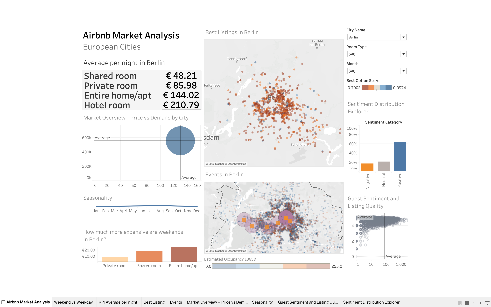

# airbnb-market-europe-tableau-project
The goal of this project was to build a data pipeline and interactive Tableau dashboard that analyzes Airbnb pricing and occupancy based on local events, property traits, review sentiment and etc., utilizing BigQuery, Python, SQL, and a Galaxy Schema architecture.

*Click the image above to view the interactive dashboard on Tableau Public.*
